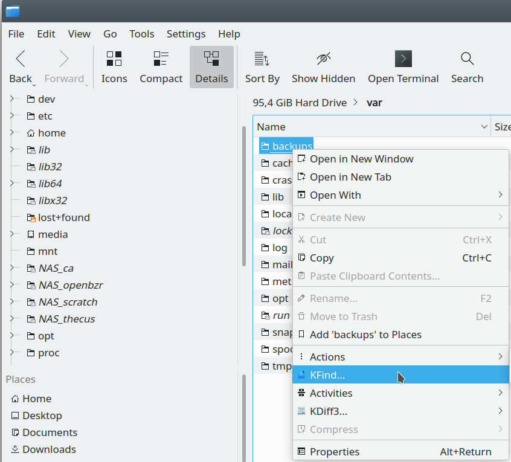

# right-click "KFind..." folder context menu in KDE/Dolphin

OS  : Kubuntu 20.04

## How to install:

1. close Dolphin
2. mkdir $HOME/.local/share/kservices5/ServiceMenus/
3. cp KFind.desktop $HOME/.local/share/kservices5/ServiceMenus/KFind.desktop
4. kbuildsycoca5

## How to use:

